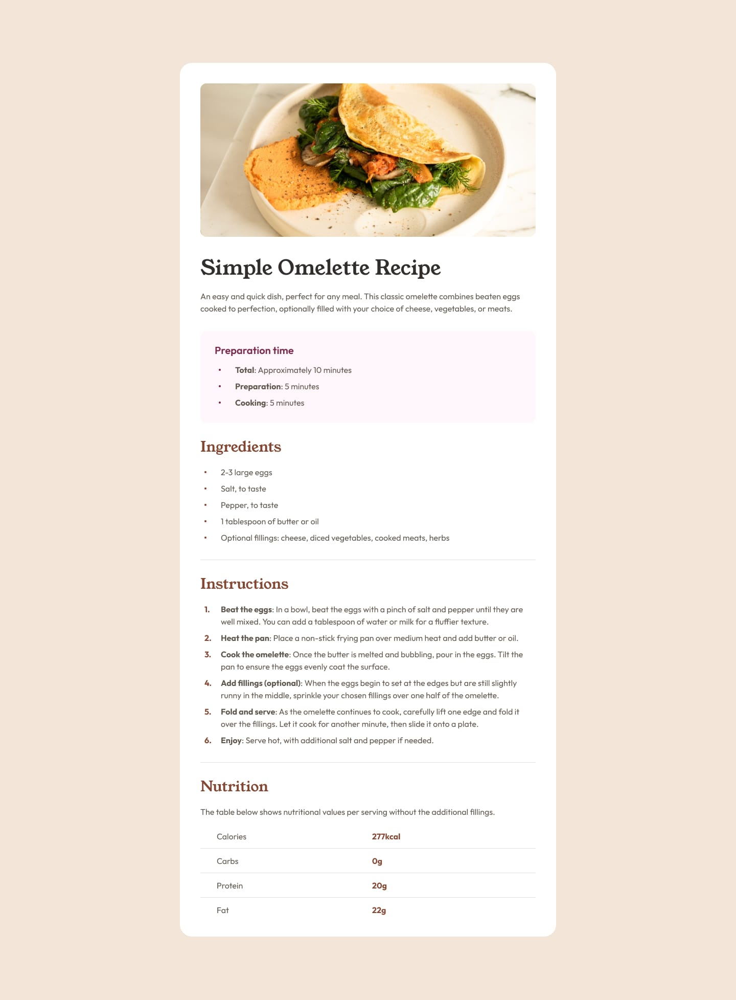

# Frontend Mentor - Recipe Page Solution

This is a solution to the [Recipe page challenge on Frontend Mentor](https://www.frontendmentor.io/challenges/recipe-page-KiTsR8QQKm). Frontend Mentor challenges help you improve your coding skills by building realistic projects.

## Table of Contents

- [Overview](#overview)
  - [Screenshot](#screenshot)
  - [Links](#links)
- [My Process](#my-process)
  - [Built With](#built-with)
  - [What I Learned](#what-i-learned)
  - [Continued Development](#continued-development)
  - [Useful Resources](#useful-resources)
- [Author](#author)
- [Acknowledgments](#acknowledgments)

## Overview

### Screenshot




### Links

- Solution URL: [Frontend Mentor Solution](https://github.com/HASSNAAM/recipe-page-maingit)
- Live Site URL: [Live Site](https://hassnaam.github.io/recipe-page-main/)

## My Process

### Built With

- Semantic HTML5 markup
- CSS custom properties
- Flexbox
- Mobile-first workflow
- [Styled Components](https://styled-components.com/) - For styles

### What I Learned

In this project, I learned to effectively utilize semantic HTML5 elements to improve the accessibility and structure of the web page. I also refined my skills in CSS custom properties, Flexbox for responsive design. Here are some code snippets that I am proud of:

#### HTML

```html
<h1>Simple Omelette Recipe</h1>
```
### CSS

```css
h1 {
   color: var(--Dark-Charcoal);
}
```
### JS

```js
const proudOfThisFunc = () => {
  console.log('🎉')
}
```

### Continued Development

Moving forward, I plan to focus on:

- Improving my JavaScript skills, particularly with modern frameworks like React.
- Enhancing my understanding of responsive design techniques.
- Exploring more advanced CSS properties and animations.

### Useful Resources

- [CSS Tricks](https://css-tricks.com) - A comprehensive resource for CSS tutorials and tips.
- [MDN Web Docs](https://developer.mozilla.org) - A valuable reference for web development documentation.
- [The Markdown Guide](https://www.markdownguide.org/) - Helped me write better markdown for documentation.

## Author

- Github - [Hassnaa Mahmoud](https://github.com/HASSNAAM)
- Frontend Mentor - [@HASSNAAM](https://www.frontendmentor.io/profile/HASSNAAM)

## Acknowledgments

Special thanks to the Frontend Mentor community for providing feedback and support throughout the project.
